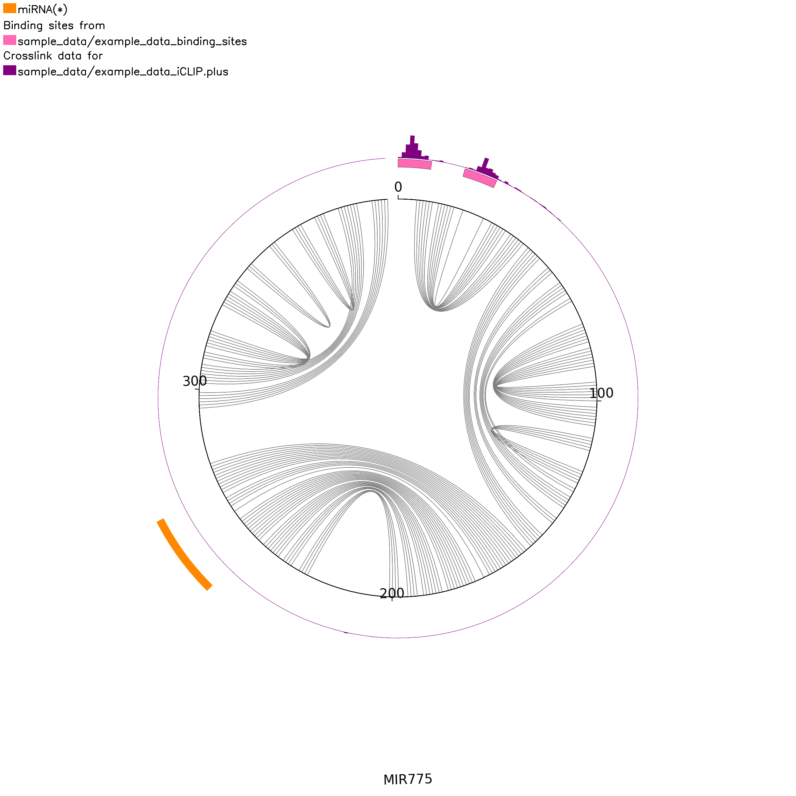

# CircosRNAfold
An Python script tool for visualization of Circos plots combining high-throughput sequencing data with two dimensional folds of RNA molecules.

The goal of this project is to develop a simple, circular visualization tool of standardized track data (e.g. binding sites of specific proteins from CLIP experiments) and their raw data on folded 2D RNA structures. Generating the plots allows the user to get an overview of their experimental data without the need to read into Circos packages or similar.


# Prerequisites
The pyCircos package (https://github.com/ponnhide/pyCircos) is used to create the diagram and Viennarna (https://github.com/ViennaRNA/ViennaRNA) is used to predict the fold.


# Installation

You can install this script directly from github with:
```
git clone https://github.com/mloskant31/CircosRNAfold.git
```

You can install the dependencies for using the script via the ```requirements.txt``` file by running the following code:
```
pip install -r requirements.txt
```
Python 3.10 or higher is required.


# Usage
The script can be started with various parameters. 
The required parameters are: 

- `-g` or `--genes` : The genomic coordinates of genes in BED format
- `-fi` or `--fasta` : The chromosomal sequences as a FASTA file

Optional parameters:
- `-b` or `--bindings` : The binding sites of proteins in BED format (max. 4 files)
- `-bw` : BigWig file(s) with the raw data (max. 4 files)
- `-m` : The mature miRNA locations in BED format
- `-color` : The colors for the iCLIP plots. If none or too few/too many colors are specified than there are specified bw files, default colors are used (max. 4 colors)
- `-o` or `--output` : Name of the folder in which all PNGs are saved

## Running CircosRNAfold with sample data: 
First, unpack the genome fasta:

```
gzip -d sample_data/example_data_TAIR10_chr_all.fas.gz
```
Then, run CircosRNAfold with sample data:

```
python3 CircosRNAfold.py --genes sample_data/example_data_gene.bed \
  --bindings sample_data/example_data_binding_sites.bed \
  --fasta sample_data/example_data_TAIR10_chr_all.fas \
  -bw sample_data/example_data_iCLIP.plus.bw \
  -m sample_data/example_data_mature_rna.bed \
  --output circoplots
```


The binding sites and iCLIP data are taken from the supplement of Meyer et al. (https://doi.org/10.1186/s13059-017-1332-x).

## Gallery

The result plot for the sample data set. From ~0 and from ~20 bp the binding sites can be seen (pink) and their iCLIP peaks (purple). At 250 bp the mature miRNA can be seen (orange). The legend is shown top left.

## RNA sequence
If the RNA sequence is less than or equal to 240 bp long and fewer than three bw files have been specified, the bases of the RNA sequence are shown as an external ring.

# Setting raw data color(s)
A maximum of four colors can be specified for the maximum of four bigWig files. There are the following four default colors: #800080 (purple), #006400 (green), #FF6347 (red), #4682B4 (blue). Depending on the number of bigWig files specified, the appropriate number of default colors are used in sequence as listed above. The default colors are used if no colors or too many/too few are specified by you. If this is the case, a message appears on the terminal. To specify the colors yourself, use the `-color` parameter followed by the colors in the hexadecimal system (without a preceding #).


# Input file format overview

| Input | Data format |
|--------------------|--------------------------------------------------------|
|Genome data|FASTA|
|Genes|BED|
|iCLIP raw data| bigWig |
|Binding Site data|BED|
|Mature RNAs|BED|

# License
MIT License
